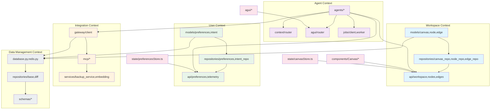

# Bounded Contexts and Module Map

**Purpose**: Document the DDD (Domain-Driven Design) bounded contexts and module boundaries per EI-005 (Modular/DDD Architecture).

**References**:
- PRD §3 EI-005 - Modular/DDD Architecture
- NFR-MAINT-001 - Bounded context documentation

---

## Overview

IntentUI is organized into **5 bounded contexts**, each with clear boundaries and well-defined interfaces. Cross-context communication occurs via:
- **Public APIs** (REST/WebSocket) for backend contexts
- **Type-safe protocols** (AG-UI) for frontend-backend communication
- **Event-driven messaging** for real-time updates

```
┌─────────────────────────────────────────────────────────────────┐
│                    IntentUI Architecture                         │
├─────────────────────────────────────────────────────────────────┤
│                                                                   │
│  ┌──────────────┐  ┌──────────────┐  ┌──────────────┐          │
│  │   Workspace  │◄─┤   Context    │─►┤    Agent     │          │
│  │   Context    │  │   Routing    │  │   Context    │          │
│  └──────┬───────┘  └──────┬───────┘  └──────┬───────┘          │
│         │                  │                  │                  │
│         ▼                  │                  │                  │
│  ┌──────────────┐          │                  │                  │
│  │     User     │◄─────────┘                  │                  │
│  │   Context    │◄────────────────────────────┤                  │
│  └──────────────┘                          │                    │
│                                            ▼                    │
│                                   ┌──────────────┐              │
│                                   │ Integration  │              │
│                                   │   Context    │              │
│                                   └──────────────┘              │
│                                                                 │
└─────────────────────────────────────────────────────────────────┘
```

---

## Bounded Contexts

### 1. Workspace Context

**Domain**: Canvas management, spatial layout, node/edge manipulation, document blocks.

**Responsibilities**:
- Canvas lifecycle (create, load, save, delete)
- Node CRUD operations
- Edge (connection) management with typed relationships
- Spatial transformations (zoom, pan)
- Selection scope (single, multi, region)
- Audio block storage

**Backend Modules** (`intentuimvp/backend/app/`):
```
models/
  ├── canvas.py       # Canvas entity
  ├── node.py         # Node entity
  ├── edge.py         # Edge/connection entity
  └── audio_block.py  # Audio block storage

repositories/
  ├── canvas_repo.py  # Canvas data access
  ├── node_repo.py    # Node data access
  ├── edge_repo.py    # Edge data access
  └── audio_block_repo.py

api/
  ├── workspace.py    # Canvas operations
  ├── nodes.py        # Node endpoints
  ├── edges.py        # Edge endpoints
  └── audio.py        # Audio block endpoints
```

**Frontend Modules** (`intentuimvp/frontend/src/`):
```
components/Canvas/
  ├── Canvas.tsx              # Main canvas component
  ├── CanvasWorkspace.tsx     # Workspace container
  ├── CanvasNode.tsx          # Node rendering
  └── edges/                  # Edge components

state/
  └── canvasStore.ts          # Zustand canvas state
```

**Public Interfaces**:
- `POST /api/workspace` - Create workspace
- `GET /api/workspace/{id}` - Load workspace
- `PUT /api/workspace/{id}` - Save workspace
- `POST /api/nodes` - Create node
- `PUT /api/nodes/{id}` - Update node
- `DELETE /api/nodes/{id}` - Delete node
- `POST /api/edges` - Create edge
- `WebSocket` - Real-time canvas updates

**Aggregates**: Canvas (root), Node, Edge, AudioBlock

**Invariants**:
- Canvas must have at least one node to be valid
- Edges must reference valid source and target nodes
- Nodes cannot be deleted if they have outgoing edges

**Dependencies**:
- User Context (for user_id scoping)
- Agent Context (for agent-generated content)

---

### 2. Agent Context

**Domain**: Agent orchestration, intent deciphering, execution lifecycle, tool usage.

**Responsibilities**:
- Command interpretation and routing
- Agent selection and execution
- Intent deciphering with confidence thresholds
- Assumption generation and reconciliation
- Tool execution (canvas actions, search, etc.)
- AG-UI protocol handling
- Job orchestration

**Backend Modules** (`intentuimvp/backend/app/`):
```
agents/
  ├── base.py              # Base agent class
  ├── orchestrator.py      # Agent orchestration
  ├── intent_decipherer.py # Intent interpretation
  ├── research_agent.py    # Research operations
  ├── judge_agent.py       # Judgment/evaluation
  ├── planner_agent.py     # Planning
  ├── synthesis_agent.py   # Content synthesis
  ├── perspective_agent.py # Multi-perspective analysis
  ├── echo_agent.py        # Simple echoing
  ├── safety.py            # Safety guardrails
  ├── tools.py             # Agent tool definitions
  └── intent_index.py      # Intent indexing

context/
  ├── router.py            # Command routing logic
  └── models.py            # Context models

agui/
  ├── router.py            # AG-UI message routing
  └── models.py            # AG-UI data models

jobs/
  ├── client.py            # Job client interface
  └── worker.py            # ARQ worker implementation

api/
  ├── context.py           # Context routing endpoint
  └── runs.py              # Agent run execution
```

**Frontend Modules** (`intentuimvp/frontend/src/`):
```
agui/
  ├── protocol.ts          # AG-UI message types
  └── client.ts            # AG-UI client

components/
  ├── ContextInput/        # Command input
  └── Assumptions/         # Assumption display/reconciliation
```

**Public Interfaces**:
- `POST /api/context` - Submit command for routing
- `POST /api/runs` - Start agent run
- `GET /api/runs/{id}` - Get run status
- `WebSocket` - AG-UI streaming
- Job queue (ARQ functions)

**Aggregates**: AgentRun, Intent, Assumption

**Invariants**:
- Agent runs must have valid intent_id
- Assumptions must be reconciled before execution (if confidence < 0.95)
- Safety checks must pass before external actions

**Dependencies**:
- Integration Context (Gateway, MCP)
- Workspace Context (for canvas action tools)
- User Context (for intent index scoping)

---

### 3. User Context

**Domain**: User identity, preferences, sessions, intent history.

**Responsibilities**:
- User preference management
- Intent index (per-user history)
- Session management
- Keyboard shortcut configuration
- Dashboard subscriptions

**Backend Modules** (`intentuimvp/backend/app/`):
```
models/
  ├── preferences.py            # User preferences
  └── intent.py                 # Intent tracking

repositories/
  ├── preferences.py            # Preferences data access
  └── intent_repo.py            # Intent data access
  └── dashboard_subscription_repo.py

services/
  ├── intent_index.py           # Intent indexing service
  └── dashboard_updates.py      # Dashboard updates

api/
  ├── preferences.py            # Preferences endpoints
  └── telemetry.py              # Telemetry data
```

**Frontend Modules** (`intentuimvp/frontend/src/`):
```
state/
  └── preferencesStore.ts       # Zustand preferences state

components/
  └── KeyboardShortcuts/        # Shortcut configuration
```

**Public Interfaces**:
- `GET /api/preferences` - Get user preferences
- `PUT /api/preferences` - Update preferences
- `GET /api/intent` - Get intent history
- `POST /api/dashboard/subscribe` - Subscribe to dashboard

**Aggregates**: User (implicit), Preferences, IntentIndex

**Invariants**:
- Intent index is scoped by user_id (NFR-PRIV-001)
- Retention policies enforced on intent records

**Dependencies**:
- None (this is a leaf context)

---

### 4. Integration Context

**Domain**: External service integrations, backup, data export.

**Responsibilities**:
- Pydantic AI Gateway client (EI-001: Gateway-Only)
- MCP server management and communication
- Backup and restore
- External API integrations (Calendar, etc.)
- Vector embeddings

**Backend Modules** (`intentuimvp/backend/app/`):
```
gateway/
  └── client.py                 # GatewayClient (EI-001)

mcp/
  ├── manager.py                # MCP server management
  ├── client.py                 # MCP client
  ├── registry.py               # Server registry
  ├── calendar.py               # Calendar integration
  └── security.py               # MCP security

services/
  ├── backup_service.py         # Backup implementation
  └── embedding.py              # Vector embedding generation

api/
  ├── backup.py                 # Backup endpoints
  └── mcp.py                    # MCP endpoints

schemas/
  └── gateway/                  # Gateway request/response schemas
```

**Frontend Modules**:
- None (integrations are backend-only)

**Public Interfaces**:
- `GatewayClient` class (internal to backend)
- `POST /api/backup` - Create backup
- `POST /api/restore` - Restore from backup
- `GET /api/mcp/servers` - List MCP servers

**Aggregates**: Backup, MCPServer

**Invariants**:
- **ALL** LLM calls must go through GatewayClient (EI-001)
- No direct OpenAI/Anthropic imports allowed
- MCP servers must be registered and validated before use

**Dependencies**:
- Workspace Context (for backup targets)
- User Context (for backup ownership)

---

### 5. Data Management Context

**Domain**: Persistence layer, repositories, database schema, migrations.

**Responsibilities**:
- Database connection management
- Repository pattern implementation
- Data validation and transformation
- Migration management (Alembic)
- Caching (Redis)

**Backend Modules** (`intentuimvp/backend/app/`):
```
database.py                    # DB connection
redis.py                       # Redis client
repositories/
  ├── base.py                  # Base repository
  ├── diff.py                  # Change detection
  └── [entity]_repo.py         # Entity-specific repos

schemas/
  ├── [entity].py              # Pydantic schemas
  └── [entity]_create.py       # Input schemas
```

**Frontend Modules**:
- None (data layer is backend-only)

**Public Interfaces**:
- `AsyncSessionLocal` - Database session
- Repository classes (internal to backend)

**Aggregates**: N/A (this is an infrastructure context)

**Invariants**:
- All database access through repositories
- No raw SQL in business logic
- Async operations only

**Dependencies**:
- All contexts depend on this for persistence

---

## Cross-Context Communication

### Context Routing (Hub)

The **Context Routing** module acts as the central hub for routing commands to appropriate agents:

```
User Input → Context Router → Agent Selection → Execution → Result
```

**Where**: `intentuimvp/backend/app/context/router.py`

**What**: 3-priority routing algorithm
1. Explicit routing (`/agent:name`)
2. Intent classification
3. Default orchestrator

**How**: Analyzes command, classifies intent, selects appropriate agent

**Why**: Enables command-driven interaction without forcing users to know which agent to use

### Communication Patterns

| From | To | Method | Protocol |
|------|-----|--------|----------|
| Frontend | Workspace | REST API | HTTP/JSON |
| Frontend | Agent | AG-UI | WebSocket |
| Frontend | User | REST API | HTTP/JSON |
| Agent | Workspace | Tools | Internal calls |
| Agent | Integration | Gateway/MCP | Internal calls |
| Workspace | Data | Repositories | Python calls |
| All | Frontend | Real-time updates | WebSocket |

---

## Dependency Rules

### No Circular Dependencies

The following rules ensure no circular dependencies:

1. **User Context** → Leaf (no outgoing dependencies)
2. **Data Management** → Infrastructure (incoming dependencies only)
3. **Integration** → Only depends on Data
4. **Workspace** → Depends on User, Data
5. **Agent** → Depends on Integration, Workspace, User

### Module Import Rules

- **Agents** MAY import: Gateway, Context, AG-UI, Tools
- **Agents** MUST NOT import: API routes, Repository implementations
- **API routes** MAY import: Repositories, Services, Schemas
- **API routes** MUST NOT import: Other API routes (circular)
- **Repositories** MAY import: Models, Database
- **Repositories** MUST NOT import: API routes, Agents

---

## Module Map (Mermaid)



---

## Validation Checklist

Per EI-005, the following must be validated:

- [x] Each bounded context has clear boundary
- [x] Modules document Where/What/How/Why
- [x] Cross-context communication via well-defined interfaces
- [x] No circular dependencies between contexts
- [x] Aggregates enforce domain invariants
- [x] Module-level documentation completed (see T2-F9.4)
- [ ] Architecture diagrams reviewed (see EI-005 Validation task)

---

## Changes and Maintenance

When modifying the architecture:

1. **Update this document** if bounded contexts change
2. **Run `eslint-plugin-import`** with `no-cycle` rule to detect circular dependencies
3. **Review cross-context interfaces** before adding new communication paths
4. **Update the Mermaid diagram** if module structure changes

**Last Updated**: 2026-01-13
**PRD Reference**: §3 EI-005 - Modular/DDD Architecture
